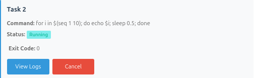
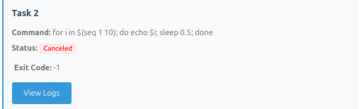
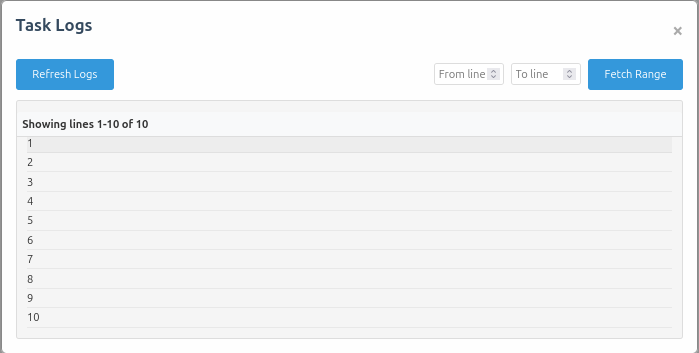

# Web-Based Task Manager
This is a web-based task manager that allows user to submit long running tasks that run asynchronously and track the status and logs of the task.
This project was made as a take-home assignment for Proxidize.

## Architecture


## Setup

### Prerequisites
- Go
- Docker (optional, for running the server as a container)
- Make (optional, for easier commands)

### Running the server
#### Run Manually
using `Makefile`
```bash
make run
```
or manually

```bash
go run cmd/api/main.go
```

#### Run as a container
```bash
make docker-build
make docker-run
```

or manually

```bash
docker build -t px-task-manager .
docker docker run -d -p 8888:8888 --name px-task-manager px-task-manager
```


## Usage

Navigate to `http://localhost:8888` to access the task manager web client.

### Web Client

#### Create a new task
Fill in the task name and command to run.
##### Quick Commands
Here are some commands to test the task manager:
- Print "Hello World"
  ```bash
  echo "hello World"
  ```
- Print numbers from 1 to 100 with a delay of 0.01 seconds between each number
  ```bash
  for i in $(seq 1 100); do echo $i; sleep 0.01; done
  ```
- Malicious command that will delete the system files
  ```bash
  rm -rf /
  ```
- Failing command that will return a non-zero exit code
  ```bash
  cat non_existent_file
  ```
  
  
Then click on the "Create Task" button to create the task.


#### View all tasks

Below the create task form, you can see all the tasks created and the status and exit code of the task.


#### Cancel a task

Click on the `Cancel` button to cancel the task, the button only appears when the task is running.



When the task is cancelled, the task will be shown in the main page with a `Cancelled` status.




#### View task logs

Click on `View Logs` button to view the logs of the task.


Then you can see the logs of the task, if the task is still running, you can see the logs in real time.




### Configuration

The server can be configured using environment variables.

| Variable | Description | Default | Notes |
|----------|-------------|-----|-------|
| CMD_VALIDATE | Whether to validate the command before running it | true |If enabled, shellcheck should be installed on the system |
| SERVER_PORT | The port to run the server on | 8888 | |
| TASK_LOGGER_DIR_PATH | The path to the task logger directory | ./task_logs | |
| DB_FILE | SQLite database file path | ./db/px.db | |
| SWAGGER_FILE_PATH | The path to the swagger file | ./api/swagger/swagger.json |


### Trade Offs and Gotchas

#### Read Log files

#### Process Group


## API Specification

### Swagger
If swagger specification does not exist, you can generate it using the following command:

```bash
make swagger
```
or manually

```bash
go install github.com/swaggo/swag/cmd/swag@latest
swag init  --parseDependency -g ./cmd/api/main.go -o ./api/swagger 
```

To access the documentation:

#### Web
1. Run the server
2. Navigate to `http://localhost:8888/api/v1/docs#/`

#### Local Files
Or find the generated swagger files in the `api/swagger` directory.

## API Documentation

### API Endpoints

#### Tasks

##### Create Task
- **Method**: POST
- **Path**: `/api/v1/tasks`
- **Payload**:
  ```json
  {
    "name": "string",
    "command": "string"
  }
  ```
- **Response**:
  ```json
  {
    "id": "string",
    "name": "string",
    "command": "string",
    "status": "string",
    "created_at": "timestamp"
  }
  ```

##### Get All Tasks
- **Method**: GET
- **Path**: `/api/v1/tasks`
- **Response**:
  ```json
  {
    "tasks": [
      {
        "id": "string",
        "name": "string",
        "command": "string",
        "status": "string",
        "created_at": "timestamp"
      }
    ]
  }
  ```

##### Get Task by ID
- **Method**: GET
- **Path**: `/api/v1/tasks/:taskID`
- **Response**:
  ```json
  {
    "id": "string",
    "name": "string",
    "command": "string",
    "status": "string",
    "created_at": "timestamp"
  }
  ```

##### Get Task Logs
- **Method**: GET
- **Path**: `/api/v1/tasks/:taskID/logs`
- **Response**:
  ```json
  {
    "logs": "string"
  }
  ```

##### Cancel Task
- **Method**: DELETE
- **Path**: `/api/v1/tasks/:taskID/cancel`
- **Response**:
  ```json
  {
    "message": "Task cancelled successfully"
  }
  ```

#### Server-Sent Events (SSE)

##### Subscribe to Events
- **Method**: GET
- **Path**: `/api/v1/events`
- **Description**: Establishes an SSE connection for real-time updates
- **Response**: Event stream with task updates
