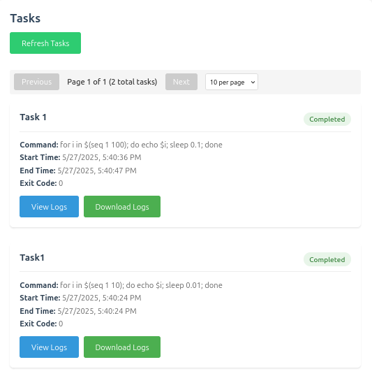

# Web-Based Task Manager
This is a web-based task manager that allows user to submit long running tasks that run asynchronously and track the status and logs of the task.
This project was made as a take-home assignment for Proxidize.

## Architecture


## Setup

### Prerequisites
- Go
- Docker (optional, for running the server as a container)
- Make (optional, for easier commands)

### Running the server
#### Run Manually
using `Makefile`
```bash
make run
```
or manually

```bash
go run cmd/api/main.go
```

#### Run as a container
```bash
make docker-build
make docker-run
```

or manually

```bash
docker build -t px-task-manager .
docker docker run -d -p 8888:8888 --name px-task-manager px-task-manager
```


## Usage

Navigate to `http://localhost:8888` to access the task manager web client.

### Web Client

#### Create a new task
Fill in the task name and command to run.
##### Quick Commands
Here are some commands to test the task manager:
- Print "Hello World"
  ```bash
  echo "hello World"
  ```
- Print numbers from 1 to 100 with a delay of 0.01 seconds between each number
  ```bash
  for i in $(seq 1 100); do echo $i; sleep 0.01; done
  ```
- Malicious command that will delete the system files
  ```bash
  rm -rf /
  ```
- Failing command that will return a non-zero exit code
  ```bash
  cat non_existent_file
  ```
  
  
Then click on the "Create Task" button to create the task.


#### View all tasks

Below the create task form, you can see all the tasks created and the status and exit code of the task.




#### Cancel a task

Click on the `Cancel` button to cancel the task, the button only appears when the task is running.


#### View task logs

Click on `View Logs` button to view the logs of the task.


Then you can see the logs of the task, if the task is still running, you can see the logs in real time.


#### Download Logs

Click on the `Download Logs` button to download the logs of the task.


### Configuration

The server can be configured using environment variables.

| Variable | Description | Default | Notes |
|----------|-------------|-----|-------|
| CMD_VALIDATE | Whether to validate the command before running it | true |If enabled, shellcheck should be installed on the system, use `make install-deps` to install it |
| SERVER_PORT | The port to run the server on | 8888 | |
| TASK_LOGGER_DIR_PATH | The path to the task logger directory | ./task_logs | |
| DB_FILE | SQLite database file path | ./db/px.db | |
| SWAGGER_FILE_PATH | The path to the swagger file | ./api/swagger/swagger.json |


## Trade Offs and Gotchas

### Read Log files
When reading log files, the server will use different readers based on the file size and the range of the logs to read.

If the user wants to read the last 100 lines of the log file, the server will use the `TailHeadReader` which will use `tail` to perform the operation.

If the user wants to read a specific range of a large log file, the server will use the `SedReader` which will use `sed` to perform the operation.

If the user wants to read the whole log file, the server will use the `BufferReader` which will read the whole file into memory.

```go
	switch {
	case from == 0 && to == 0: // Get last 100 lines
		l.logger.Info("using tail head reader")
		reader = NewTailHeadReader(l.config, l.logger, taskID) // Use tail to read last 100 lines

	default:
		if fileSize > MaxFileSize {
			l.logger.Info("File size is greater than 1MB, using sed reader")
			reader = NewSedReader(l.config, l.logger, taskID) // Use sed to read a specific range, when file is large
		} else {
			l.logger.Info("File size is less than 1MB, using buffer reader")
			reader = NewBufferReader(l.config, l.logger, taskID) // Use buffer to read the whole file, when file is small
		}
	}
```

Here are the benchmark results for the different readers with different file sizes and ranges:
Benchmark results:
```
BenchmarkTailHeadReader/DefaultLastLines-8         	                        146	  7228285 ns/op	  197962 B/op	     200 allocs/op
BenchmarkTailHeadReader/SpecificRange_SmallRange_10Percent-8         	      73	  15612954 ns/op	  197825 B/op	     203 allocs/op
BenchmarkTailHeadReader/SpecificRange_MidRange_25Percent-8           	      64	  17748550 ns/op	  519238 B/op	     210 allocs/op
BenchmarkTailHeadReader/SpecificRange_LargeRange_50Percent-8         	      42	  25451076 ns/op	  929176 B/op	     214 allocs/op
BenchmarkTailHeadReader/SpecificRange_HugeRange_30to90Percent-8      	      14	  73096501 ns/op	192401233 B/op	     243 allocs/op
BenchmarkTailHeadReader/SpecificRange_FullRange-8                    	       3	 402475912 ns/op	444649560 B/op	     254 allocs/op
BenchmarkSedReader/DefaultLastLines-8                                	      81	  13428378 ns/op	  197705 B/op	     202 allocs/op
BenchmarkSedReader/SpecificRange_SmallRange_10Percent-8              	      85	  12936926 ns/op	  197870 B/op	     203 allocs/op
BenchmarkSedReader/SpecificRange_MidRange_25Percent-8                	      80	  12771140 ns/op	  519142 B/op	     208 allocs/op
BenchmarkSedReader/SpecificRange_LargeRange_50Percent-8              	      82	  13073244 ns/op	  929002 B/op	     211 allocs/op
BenchmarkSedReader/SpecificRange_HugeRange_30to90Percent-8           	      20	  55361485 ns/op	192400966 B/op	     239 allocs/op
BenchmarkSedReader/SpecificRange_FullRange-8                         	       9	 114927408 ns/op	444649080 B/op	     247 allocs/op
BenchmarkAwkReader/DefaultLastLines-8                                	      68	  16119591 ns/op	  193362 B/op	     196 allocs/op
BenchmarkAwkReader/SpecificRange_SmallRange_10Percent-8              	     142	   8070630 ns/op	  193281 B/op	     196 allocs/op
BenchmarkAwkReader/SpecificRange_MidRange_25Percent-8                	     124	   9352097 ns/op	  500311 B/op	     199 allocs/op
BenchmarkAwkReader/SpecificRange_LargeRange_50Percent-8              	      99	  11157353 ns/op	  894036 B/op	     202 allocs/op
BenchmarkAwkReader/SpecificRange_HugeRange_30to90Percent-8           	      24	  54710929 ns/op	178160818 B/op	     212 allocs/op
BenchmarkAwkReader/SpecificRange_FullRange-8                         	       4	 256333644 ns/op	399935126 B/op	     218 allocs/op
BenchmarkBufferReader/DefaultLastLines-8                             	      19	  62706467 ns/op	144005081 B/op	  505023 allocs/op
BenchmarkBufferReader/SpecificRange_SmallRange_10Percent-8           	    2046	    694005 ns/op	   34906 B/op	     118 allocs/op
BenchmarkBufferReader/SpecificRange_MidRange_25Percent-8             	     618	   1959110 ns/op	  151783 B/op	     520 allocs/op
BenchmarkBufferReader/SpecificRange_LargeRange_50Percent-8           	     297	   4017274 ns/op	  296311 B/op	    1022 allocs/op
BenchmarkBufferReader/SpecificRange_HugeRange_30to90Percent-8        	      87	  12875327 ns/op	56911861 B/op	  166708 allocs/op
BenchmarkBufferReader/SpecificRange_FullRange-8                      	      37	  32366249 ns/op	172719325 B/op	  500046 allocs/op
```

#### Process Group

When the app receives a Signal(SIGTERM, SIGINT, etc), go runtime will close all the running sub-processes, without the app knowing,
to fix this, we can use `os/signal` package to listen to the signal and close the sub-processes.
```go
func main() {
	quit := make(chan os.Signal, 1)
	signal.Notify(quit,
		syscall.SIGINT,
		syscall.SIGTERM,
		syscall.SIGQUIT,
	)
	select {
	case v := <-quit:
		log.Infof("signal.Notify: %v", v)
	case <-ctx.Done():
		log.Infof("ctx.Done received")
	}
}
```

Even if the app intercepts the signal, it will not be able to stop the runtime from closing the sub-processes,
to fix this, we can start the sub-processes in a new process group.
```go
	s.cmd = exec.CommandContext(s.ctx, "bash", "-c", s.command) // Command context is used to stop the command when the context is cancelled
	s.cmd.SysProcAttr = &syscall.SysProcAttr{
		Setpgid: true, // create a new process group, prevent the command from receiving the SIGINT signal
	}
```

and  then we can cancel the context to stop the sub-processes.
```go
s.cancel()
```

### Real-time Updates

The application uses Server-Sent Events (SSE) for real-time task status updates. Here's a comparison of different real-time update mechanisms and why SSE was chosen:

| Feature | SSE | WebSocket | Long Polling |
|---------|-----|-----------|--------------|
| Connection Type | One-way (server to client) | Full-duplex (bidirectional) | One-way with repeated requests |
| Protocol | HTTP | WebSocket (WS/WSS) | HTTP |
| Connection Overhead | Low | Medium | High |
| Client Implementation | Simple (native EventSource) | Complex | Simple |
| Auto-Reconnection | Built-in | Manual implementation needed | Manual implementation needed |
| Server Resources | Efficient | Medium | High (constant new connections) |
| Use Case Fit | Perfect for server updates | Overkill for one-way updates | Inefficient for frequent updates |
| Browser Support | Excellent | Excellent | Universal |
| Bandwidth Usage | Efficient | Efficient | Inefficient (header overhead) |

SSE was chosen for this application because:
1. We only need one-way communication (server to client)
2. Native browser support via EventSource makes client implementation simple
3. Built-in reconnection handling improves reliability
4. More efficient than long polling for frequent updates
5. Lower overhead compared to WebSocket for our use case

## API Specification

### Swagger
If swagger specification does not exist, you can generate it using the following command:

```bash
make swagger
```
or manually

```bash
go install github.com/swaggo/swag/cmd/swag@latest
swag init  --parseDependency -g ./cmd/api/main.go -o ./api/swagger 
```

To access the documentation:

#### Web
1. Run the server
2. Navigate to `http://localhost:8888/api/v1/docs#/`

#### Local Files
Or find the generated swagger files in the `api/swagger` directory.

## API Documentation

### API Endpoints

#### Tasks

##### Create Task
- **Method**: POST
- **Path**: `/api/v1/tasks`
- **Request Body**:
  ```json
  {
    "name": "string",     // required
    "command": "string"   // required
  }
  ```
- **Response**:
  ```json
  {
    "success": true,
    "data": {
      "task_id": "number"
    },
    "code": 200,
    "message": "string",
    "error": null
  }
  ```

##### Get All Tasks
- **Method**: GET
- **Path**: `/api/v1/tasks`
- **Query Parameters**:
  - `offset` (number, optional): Pagination offset
  - `limit` (number, optional): Number of tasks per page
  - `status` (number, optional): Filter by task status (1=Queued, 2=Running, 3=Completed, 4=Failed, 5=Cancelled)
- **Response**:
  ```json
  {
    "success": true,
    "data": {
      "tasks": [
        {
          "id": "number",
          "name": "string",
          "command": "string",
          "status": "number",
          "reason": "string",
          "exit_code": "number",
          "start_time": "number",
          "end_time": "number"
        }
      ],
      "total": "number"
    },
    "code": 200,
    "message": "string",
    "error": null
  }
  ```

##### Get Task by ID
- **Method**: GET
- **Path**: `/api/v1/tasks/:taskID`
- **Path Parameters**:
  - `taskID` (number, required): ID of the task
- **Response**:
  ```json
  {
    "success": true,
    "data": {
      "id": "number",
      "name": "string",
      "command": "string",
      "status": "number",
      "reason": "string",
      "exit_code": "number",
      "start_time": "number",
      "end_time": "number"
    },
    "code": 200,
    "message": "string",
    "error": null
  }
  ```

##### Get Task Logs
- **Method**: GET
- **Path**: `/api/v1/tasks/:taskID/logs`
- **Path Parameters**:
  - `taskID` (number, required): ID of the task
- **Query Parameters**:
  - `from` (number, optional): Start line number
  - `to` (number, optional): End line number
  > Note: `from` and `to` must be provided together if used
- **Response**:
  ```json
  {
    "success": true,
    "data": {
      "logs": ["string"],
      "total_lines": "number"
    },
    "code": 200,
    "message": "string",
    "error": null
  }
  ```

##### Cancel Task
- **Method**: DELETE
- **Path**: `/api/v1/tasks/:taskID/cancel`
- **Path Parameters**:
  - `taskID` (number, required): ID of the task
- **Response**:
  ```json
  {
    "success": true,
    "data": null,
    "code": 200,
    "message": "Task cancelled successfully",
    "error": null
  }
  ```

#### Server-Sent Events (SSE)

##### Subscribe to Events
- **Method**: GET
- **Path**: `/api/v1/events`
- **Description**: Establishes an SSE connection for real-time updates
- **Event Types**:
  - Task Status Updates (type=1):
    ```json
    {
      "task_id": "number",
      "status": "number",
      "reason": "string",
      "exit_code": "number"
    }
    ```
  - Log Updates (type=2):
    ```json
    {
      "task_id": "number",
      "line_number": "number",
      "line": "string"
    }
    ```

All endpoints may return the following error responses:
```json
{
  "success": false,
  "data": null,
  "code": number,  // 400, 401, 404, or 500
  "message": "string",
  "error": "string"
}
```
